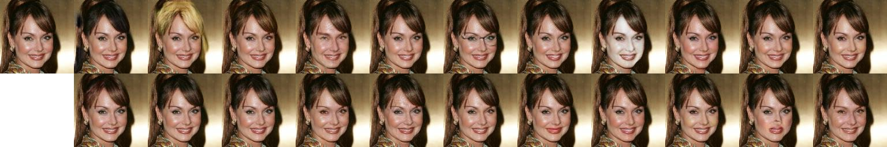

# RAG

Residual Attribute Generative Adversarial Network

[paper](https://ieeexplore.ieee.org/document/8746217)




## Train

Download the [CelebA](http://mmlab.ie.cuhk.edu.hk/projects/CelebA.html) dataset as well as the annotation file for facial attributes, `list_attr_celeba.txt`

Convert the data to tfrecord for convenience

```
python main.py --phase tfrecord
```

Train the model

```
python main.py --phase train
```

You can also download the pretrained model of `celeba`, unzip it and you will get a folder named `output`

## Test

Test the model. You need to specify the test image by `--test_img`, where the default value is `'000009.jpg`

```
python main.py --phase test --test_img your_test_img
```

The generated image is saved as `output/RAG_{dataset_name}/result/result.jpg`

The first and the second rows demonstrate the results where a certain facial attribute is enhanced or supressed