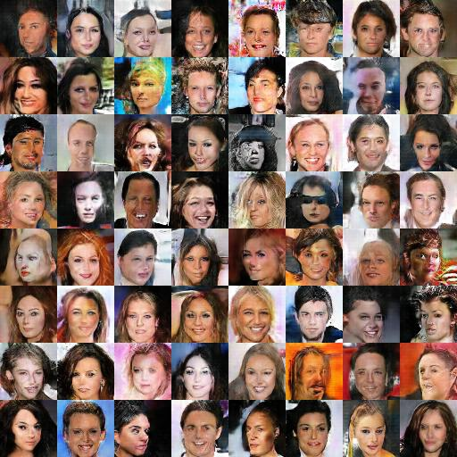
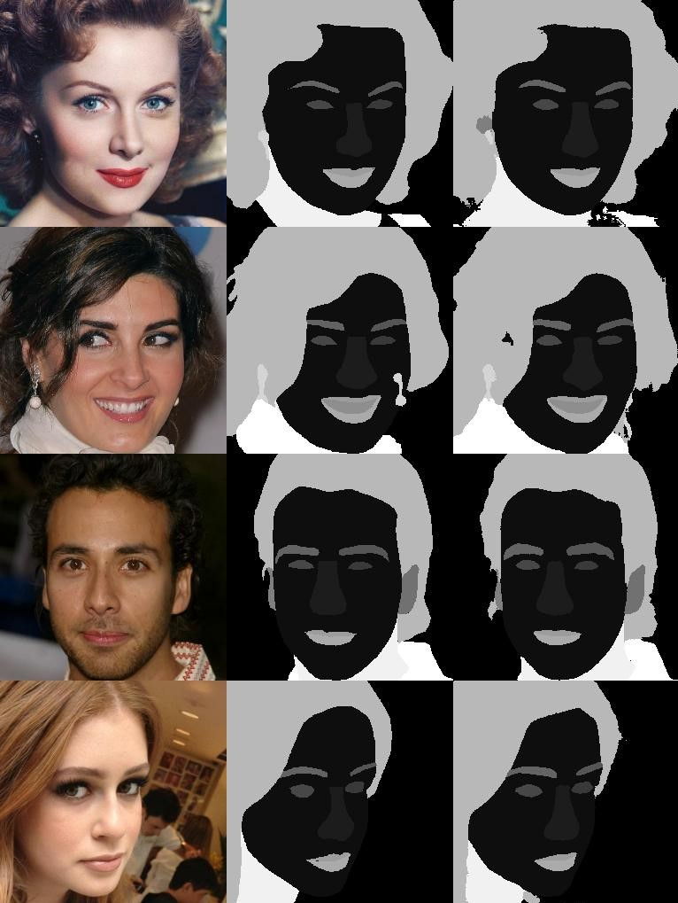
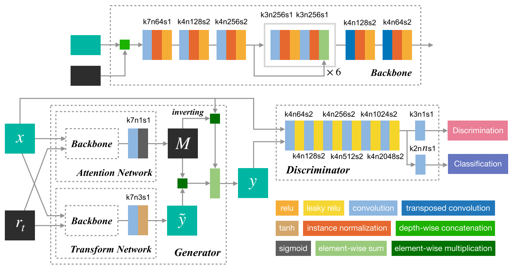
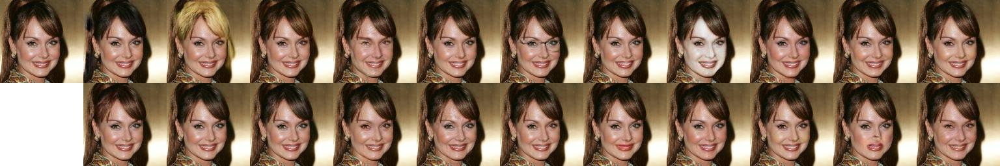

# TF2GAN

TensorFlow 2.0 implementations of some awesome Generative Adversarial Networks

Pretrained models: [Tencent Drive](https://share.weiyun.com/5zidEUa), 2nv5sp

## Image Generation

### [DCGAN](DCGAN/) (Deep Convolutional Generative Adversarial Network)

[paper](https://arxiv.org/abs/1511.06434) [project](https://github.com/carpedm20/DCGAN-tensorflow)

## Semantic Segmentation

### [UNet](UNet/) (Convolutional Networks for Biomedical Image Segmentation)

[paper](https://arxiv.org/abs/1505.04597)

## Facial Attribute Editing

### [RAG](RAG/) (Residual Attribute Generative Adversarial Network)

[paper](https://ieeexplore.ieee.org/document/8746217)

