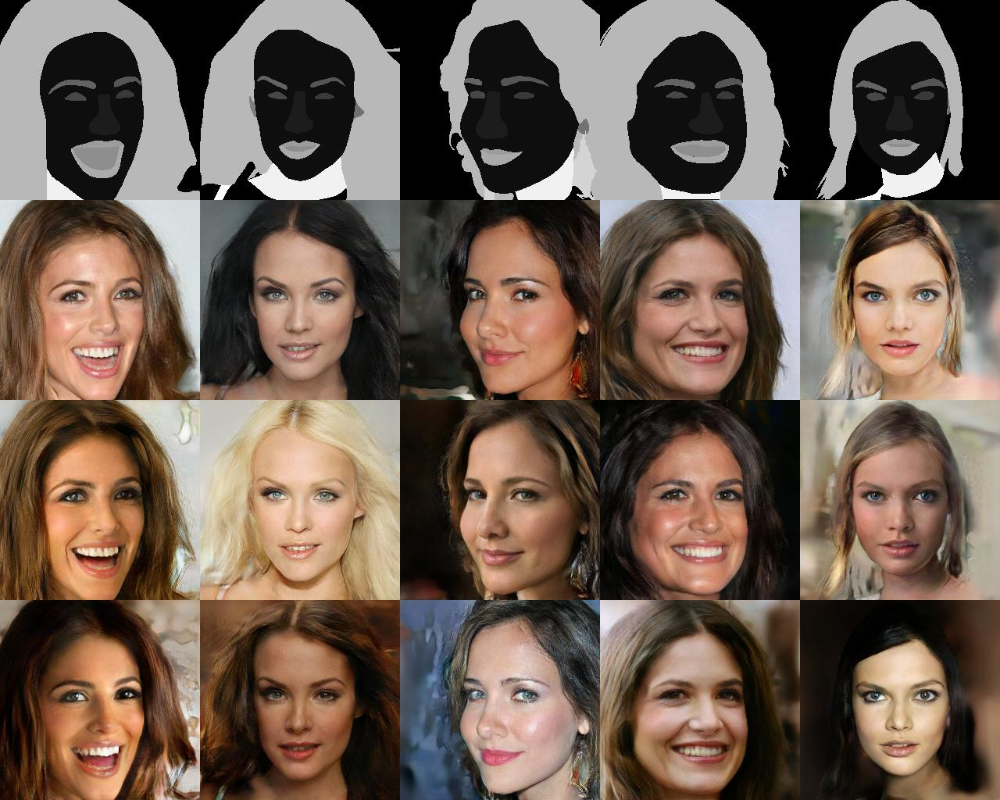

# SPADE

Semantic Image Synthesis with Spatially-Adaptive Normalization

[paper](https://arxiv.org/abs/1903.07291) [project](https://nvlabs.github.io/SPADE/)





## Train

Make a folder under `dataset` and put your images as well as labels in it, just like the `CelebAMask19` folder

Convert the data to tfrecord for convenience, where the default value of `--dataset_name` is `CelebAMask19`

```
python main.py --dataset_name your_dataset_name --phase tfrecord
```

Train the model

```
python main.py --dataset_name your_dataset_name --phase train
```

## Test

Test the model. You need to specify the following three options

- `--test_img_dir`: the folder of images to test, whose default value is `img`
- `--test_label_dir`: the folder of labels to test, whose default value is `label`
- `--test_mode`: either `random` or `combine`

You can also download the pretrained model of `CelebAMask19`, unzip it and you will get a folder named `output`

```
python main.py --phase test --test_mode combine
```

The generated `random.jpg` and `combine.jpg` are saved in `output/SPADE_{dataset_name}/result/`